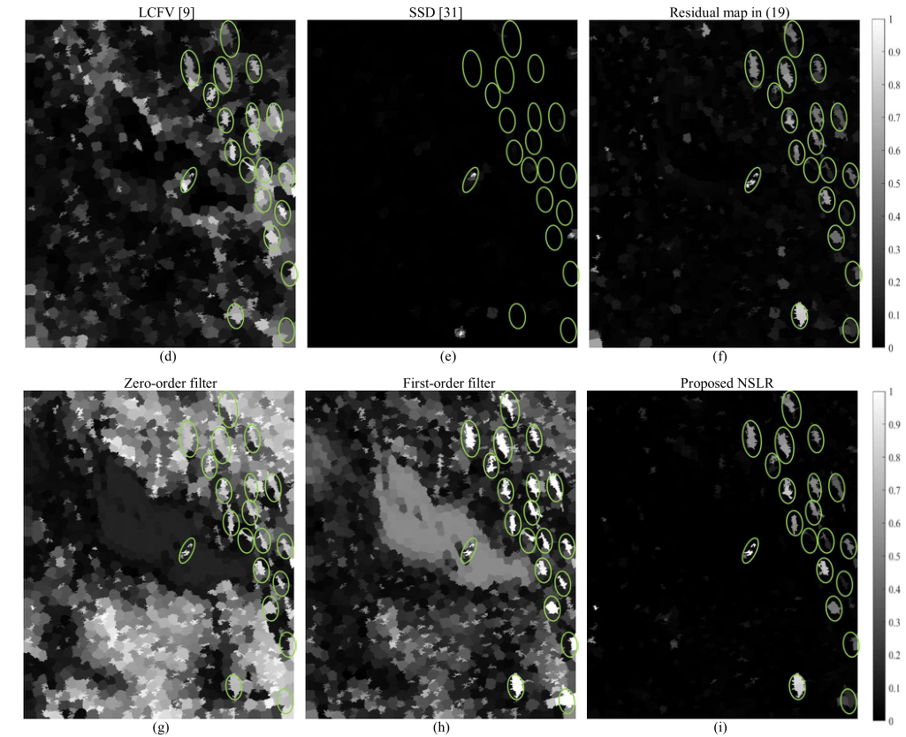

# Ship Detection in SAR Images via EnhancedNonnegative Sparse Locality-Representationof Fisher V ectors

**年份：2021
作者：Xueqian Wang,
出处：{TRANSACTIONS ON GEOSCIENCE AND REMOTE SENSING
引用：Wang X, Li G, Plaza A, et al. Ship detection in SAR images via enhanced nonnegative sparse locality-representation of Fisher vectors[J]. IEEE Transactions on Geoscience and Remote Sensing, 2021, 59(11): 9424-9438.**

## 1. Summary

* 超像素分割
* 计算FV向量v
* 构造BCD下的FV向量，并且计算BCD中的残差
* 残差过滤波
* 双参数法确定阈值
* 二值检测
在本文中，提出了一种**新的NSLR检测器**，用于SAR图像中基于**超像素的舰船检测**，其中创新性地考虑了基于fv的子空间特征。提出的NSLR检测器是基于一个假设设计的，即超像素的FV可以由杂波超像素构造的BCD稀疏表示。利用NSLR算法计算fv的表示残差来区分舰船目标和背景海杂波。此外，还开发了两个基于FVs的滤波器，利用舰船目标的强度和空间特征，以增强所提出的NSLR方法在异构海杂波场景中的性能。基于高分3号SAR图像的实验表明，与现有和常用的舰船探测器相比，本文提出的NSLR探测器在复杂度增加可承受的情况下显著提高了检测性能。利用SAR图像中的高阶信息以及将NSLR与舰船目标分类算法相结合将是我们未来的研究方向。
## 2. Research Objective(s)

舰船检测、Fisher vectors、稀疏表示、超像素分割 

## 3. Background / Problem Statement

现有的基于fv的舰船检测方法往往考虑目标fv与杂波fv之间的欧氏距离，**通常不利用fv的子空间特征**。在本文中，我们提出了一种新的基于**非负稀疏局部表示(NSLR)的船舶检测算法**，利用fv的**子空间特征**。本文提出的NSLR方法是基于只有在零假设下背景海杂波字典稀疏表示SAR图像超像素fv的假设。此外，我们还提出了**两种基于fv的滤波器**，通过进一步利用舰船目标在强度和空间方面的内在特征来增强我们新开发的NSLR对异质海杂波环境的鲁棒性。基于高分3号SAR图像的实验结果表明，本文提出的NSLR检测方法具有更高的目标杂波对比度，比其他常用的舰船检测算法具有更好的检测性能。

## 4. Method(s)

### 1.1 超像素算法
* 第一步：**窗口长度为S**，以S为间隔分割整张图像（每个像框内的像素点都接近于 $S*S$ ），初始化超像素中心。
>  按照设定的超像素个数，在图像内均匀的分配种子点。假设图片总共有 N 个像素点，预分割为 K 个相同尺寸的超像素，那么每个超像素的大小为N/ K ，则相邻种子点的距离（步长）近似为 
>$S=\sqrt{N/K}$。

* 第二步：利用该式子测量中心像素和周围像素的关联，**搜索范围**是 $2S*2S$ 其中$\tau$代表设定的系数，用来平衡空间和强度差异。
  
  

* 第三步：通过对应像素的平均坐标更新每一个超像素中心
> 每一个像素点都会被多个中心像素搜索到，取距离最小的为其中心像素点标签

* 第四步：一直迭代，重复二三步，直到设定的迭代次数完成（收敛的话，每个像素点的标签在迭代之后稳定于一个标签）

做完超像素分割之后，第P个超像素包含的像素点有 $L_p$ 个。

### 1.2 计算Fisher Vectors
首先，构建GMM模型对SAR图像的超像素进行建模。然后，基于GMM导出超像素的FV（Fisher Vectors），测量当前超像素与全局图像的偏差。下列算法都是在每一个超像素内部进行计算的

**GMM**是一个著名的flexible modle，他是 $N_G > 1$ 高斯分量的线性组合，能够以任意精度接近任意连续分布，其概率分布公式为：
 
 $g(\delta) = \displaystyle\sum_{n=1}^{N_G}w_n\aleph(\delta;\mu_n,\sigma^2_n)$

 

$\delta$ 表示像素点的强度 $w_n$ 表示mixture weight的一个权值？ 貌似是混合权重 $\mu_n$ 表示均值， $\sigma^2_n$ 表示标准差

* 第一步：实际上就是给每一个像素一个权重 $\delta$，然后以像素强度为输入，根据每一个超像素范围内的均值标准差，求得 $g(\delta)$.
* 第二步：构造计算梯度需要的集合 $\Lambda$ ，一共有 $N_G$ 个像素点，求这些像素点对应权值、均值、标准差的向量集合。

* 第三步：文章给了GMM的公式推导，目前看着不知道有什么用，复现算法时可以直接根据结果进行计算。
  * 首先是这个公式构造了文章的核心向量 $f_p$
  
   

   对于这个公式，$\bigtriangledown_\Lambda$ 代表对 $\Lambda$ 向量求梯度， $\Phi$ 代表对F的Cholesky分解

   

  * 然后论文给出了最终的FisherVector的结果
  
    

    这里 $\beta_n = (\frac{exp(w_n)}{\sum_{\hat n=1}^{n}exp(w_{\hat n})})$ 
    $\phi^{(n)}_{p,l} = \displaystyle \frac {w_n\aleph(\delta;\mu_n,\sigma^2_n)}{\sum_{\hat n=1}^{N_G}{w_ {\hat n}}\aleph(\delta;\mu_{\hat n},\sigma^2_{\hat n})}$
    $w_n$ 是那一串权值，这个 $f_p$ 里面的那个 $N_G$ 是GMM里面的参数，和超像素的大小没关系，在GMM里面，它代表该混合高斯分布需要拟合 $N_G$ 个特征矢量的分布，但是这里的 $\hat n$ 有点不理解，是什么意思，可能是代表不同的超像素区域
### 1.3 NSLR OF FVs
> a、非负稀疏locality-constranied表示 **(NSLR)**
> b、背景杂波字典，background clutter dictionary **(BCD)**
> c、这一节主要介绍用**NSLR构造BCD**、**计算SR稀疏**和**计算表示残差**的步骤

如果测试超像素是一个“异常”舰船目标，则BCD中的活性基与异常测试超像素的FV存在显著差异。另一方面，当测试超像素是一个正常的超像素时(比如背景杂波中的超像素)，它的FV可以使用BCD中的主动基精确表示。通过将表示残差与决策阈值进行比较，可以将NSLR视为无监督子空间检测器，检查测试超像素与其局部背景之间是否存在显著性差异。

* 第一步：BCD构建（利用双窗口获取当前测试超像素的BCD）
  
  

  蓝线代表超像素的边界。红色圆圈表示测试超像素的背景超像素，绿色圆圈表示测试超像素。带有黑色圆圈的超像素是背景杂波中潜在的离群超像素，例如目标超像素。黄色虚线代表外部正方形窗口，是局部背景的边界。内部窗口可以由测试超像素（绿色圆圈）的边界像素决定，也就是说将测试超像素(居中)附近的超像素从局部背景中移除。
  
  局部背景超像素的三个必要条件
  * 外部的方形窗口边长为M；
  * 不包括待测超像素周围的像素；
  * 该超像素没有被异常超像素影响；
  > 条件1)在不失一般性的前提下，我们设置$M = 5 * S$，以保证外窗边长大于测试超像素的大小;
  > 条件2)当测试超像素只是大型舰船目标的一部分时,保证背景超像素集仍然是纯的。
  > 条件3)与海杂波和拥挤目标场景有关，其中局部背景可能存在一些异常超像素。这里，异常超像素被定义为具有异常强度的超像素。对于第p个检验超像素，首先找到满足条件1)和2)的超像素，如果其平均强度在区间$\left[ V_{p,min},V_{p,max} \right] $之外，则通过剔除异常值进行细化，其中
  $ V_{p,min} = \overline{\mu}_p - 2  \overline{\sigma}_p $
  $ V_{p,max} = \overline{\mu}_p + 2  \overline{\sigma}_p $
  $\overline{\mu}$ 和 $\overline{\sigma}$分别代表满足条件1)和2)的超像素所包含的所有像素强度的平均值和标准差。这里上式有一个95%的置信区间，相信在$\left[ V_{p,min},V_{p,max} \right] $具有平均强度的超像素不是异常值。
  * 令$ \Theta_p $ 为图像中第p个代检验超像素的满足条件的超像素集合，我们可以这样构造第P个超像素点的BCD的FVs向量
  

这里$ I_p = |\Theta_p|$

* 第二步：计算SR系数
  * 在BCD的 $\Psi_p$中通过NSLR计算$f_p$
  

    这里 $\theta_p$ 代表了第P个超像素的SR向量，$\lambda$ 是规则化参数，$\odot$ 代表哈达玛积。
    > 若 $c_{ij} = a_{ij} * b_{ij}$ ,则称矩阵 $C = (c_{ij})$ C=(cij)为A和B的哈达玛积，或称基本积
    
    而 $d_p$ 代表FV向量之间的欧式距离，它的计算方式如下： **本实验中$v = 10$**
    
    这里 $v > 0$代表了指数衰减速度的常数，$d_p$在这里就是为了鼓励FV的 $f_p$ 更接近构造出来的BCD中的 $f_p$，$\Psi_{p,i}$ 代表矩阵 $\Psi_p$中的第i个元素， $\theta_{p,i}$的和为1，这一点约束是为了强调NSLR的shift-invariant feature，$\theta_{p,i} > 0$ 这个非负约束涉及到目标fv和背景杂波fv之间的非负相关性。因为这两个fv在非负的条件下是不能互相表示的，则就增强了目标和背景杂波的可分性。

    另此处不用$l_0$范数约束，因为局部描述符$d_p$直接导致稀疏性。
  * 所以第二步中的 $\hat{\theta}_p$ 可以这样计算：**（本实验中$\lambda = 10$）**
  
  

  **1**表示全1向量，diag表示向量对角化操作
  * 然后添加非负约束
  
  

  此处 $\theta_p^*=\min_{i}\left\{ \theta^*_{p,i},i = 1, 2,\cdots ,I_p \right\} $
  * 之后将 $\hat{\theta}_p$ 中小于均值的数都设定为0来增加稀疏性。
  * 最后归一化 $\hat{\theta}_p$ 
  $ \hat{\theta}_p \leftarrow  \frac{\hat{\theta}_p}{\sum_{i=1}^{I_p}{\hat{\theta}_{p,i}}}$

* 第三步：残差表示的计算

  
  
  可以用来区分舰船目标和海杂波。如果测试超像素属于海杂波，其表示残差接近于0(因为杂波FV位于BCD所跨越的低维子空间)。相反，如果测试超像素被舰船目标占据，则对应的表示残差值较大，因为BCD中目标FV不能用杂波FV线性表示。因此，如果rp大于预定义的决策阈值，则第p个超像素可以标记为舰船目标超像素。

### 1.4 滤波嵌入目标特征？（Filtering Embedding Target Features）
在本节中，设计了两个基于FV的滤波器，将舰船目标的固有知识嵌入到NSLR中。这两种滤波器有助于增强NSLR对异构杂波的鲁棒性。

一般来说，舰船目标在SAR图像中表现出以下两个特征:
1)空间稀疏性。舰船目标在SAR图像中比海杂波占用更少的像素，
2)强度值更大。舰船目标经常出现在SAR图像的明亮部分。
如图4所示，舰船目标的上述相关特征可以通过fv中的零阶和一阶信息来反映。在图4(a)中，我们展示了一个SAR图像切片及其超像素分割结果。图4(b)和(c)给出了图4(a)的全局GMM的权值和均值，其中NG = 7。GMM中的权重参数{ωn，∀n}表示SAR图像中属于相应高斯分量的像素的比例(空间性)。

**所以在这里可以大概感觉到，作者利用7个高斯分布拟合全图，$\omega_n$ 每一个标签像素点总和所占全图像素点的比例，$\mu_n$表示每一个标签内像素点的均值**

由图4(b)和(c)可以看出，权值最小的高斯分量的平均值最大(见第一个分量)。该分量与舰船目标的空间稀疏性和大强度值相一致。因此，预计舰船目标属于权重最小、均值最大的高斯分量，而背景杂波倾向于占据其他分量。由(4)、(6)、(7)可知，FV中的零阶和一阶值代表当前超像素对全局GMM中权重和均值参数的“得分”。图4(d)和(e)给出了图4(a)中标记的目标和杂波超像素fv的零阶和一阶值。从图4(d)和(e)可以看出，目标超像素在第一个高斯分量对应的权重最小得分最高，均值最大。相反，杂波超像素对第一个高斯分量的参数得分较小，对其他高斯分量的参数得分较大。

* 第一步：根据这一点，实验设计了两个滤波器

通过这个滤波，可以让 $\xi_p^{(0)}$$\xi_p^{(1)}$在这个超像素为目标时变得较大，因为目标超像素点在GMM中权重最小均值最大。同理可以抑制背景杂波。

* 第二步：将这两个滤波器用到残差当中

这一步当中，是将滤波器算出来的权值归一化了，增强鲁棒性。

### 1.3 阈值分割
利用滤波之后的 $R_p$进行阈值分割
> 采用双参数法进行阈值分割：
> 
> $\mu$ 和 $\sigma$分别代表$R_p$集合当中的均值和标准差，$\varsigma$代表调整因素，建议从3-14

## Evaluation
* 数据来源
  
* 对比方法：
  * superpixel-based local contrast measure (SLCM)
  * local contrast of FV (LCFV)
  * superpixel-level statistical dissimilarity (SSD)
  * NLSR detector
* 评价指标
  * contrast factor (CF)
  
  其中 $R'_\omega = \max_p{R_p, p\in Tar^{(\omega)}}$ ，$Tar^{(\omega)}$ 和 $Clu$代表真值图上第 $\omega$ 个目标和背景区域 $|Clu|$ 代表背景中超像素个数。
  > SCR反映了原始SAR图像中舰船目标与杂波的差异，CF描述了通过设计的测试统计量对目标进行增强后的SAR图像中舰船目标与杂波的差异。CF值越大，说明阈值分割更容易从强背景杂波中检测出弱舰船目标

  * probability of detection ($Pr_d$)
  * probability of false alarm ($Pr_{fa}$)
  
  这里 $N_{Dectar}$ 和 $N_{Decfal}$ 代表检测到的目标和虚警的超像素个数。
  * receiver operating characteristic curve (ROC)
  * area under the curve (AUC)
* 参数设定
  * 超像素大小S可以根据舰船目标所占区域内平均像素数的固定百分比(如25%-100%)来选择。本实验中该超像素大约占600个像素点，S = 18（$\frac{S^2}{600} \approx 50%$）。在SLIC生成超像素时，较大的超像素S有助于加快检测任务，但可能会降低检测性能；
  * SLIC中的平衡参数 $\tau$ 小于1或者等于1，迭代次数为20；
  * $N_G = 7$，太小了则无法对复杂的海面进行有效建模
  * $\lambda = v = 10$
* 从CF参数看各个分类方法的性能
  
## Conclusionv
* 小图像
  * 从图像的直观性质来说
  
  
  (f)表示滤波前的残差图像，$r_p$
  (i)表示滤波后的残差图像，$R_p$  
  表示本文提出的方法有助于降低杂波水平，增强舰船目标。此外，对比图10(f)和图10(i)可以看出，本文提出的零阶和一阶滤波器提高了船舶检测性能。

  * 从指标上来说
  
  从图11和图12可以看出，本文提出的NSLR检测器比其他竞争的不同超像素尺寸的检测器具有更好的全局检测性能。图11和图12中roc曲线的auc见表V。图12中NSLR提供了更高的auc。

* 大图像
  * 直接指标（因为图像直观效果和小图像类似）
  

* 从时间层面来讲，本算法稍微增加了计算时间，主要是fv计算和矩阵求逆
## Notes(optional) 

## References(optional) 