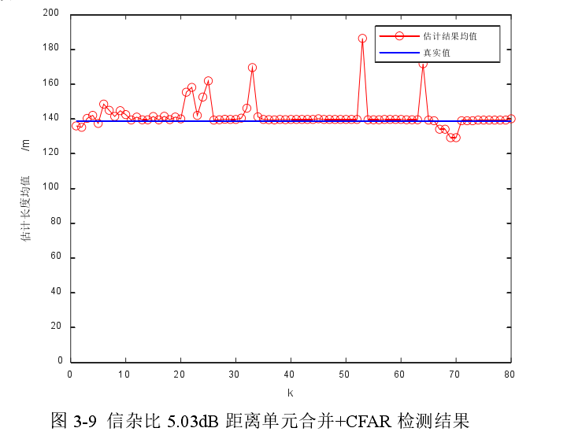

# 基于HRRP与ISAR图像融合的舰船目标识别研究

**年份：2020**

**作者：徐鹏政**

**出处：知网（硕士论文） 哈尔滨工业大学**

**引用：徐鹏政. 基于HRRP与ISAR图像融合的舰船目标识别研究 [D]; 哈尔滨工业大学, 2020.**

## 1. Summary
由于当前研究单一地使用 HRRP 或者单一地使用 ISAR 图像进行识别的现状，本文主要对同时融合 HRRP 和 ISAR 图像进行舰船目标的识别的方法进行了研究，包括融合二者进行目标识别提高识别率的方法以及融合二者提高长度估计精度的方法。在融合识别的方法上，本文采用基于 DS 证据理论的融合和基于分类器选择的融合两种方法。在长度的融合上，由简单到复杂，先后利用零均高斯分布、非零均值高斯分布对 HRRP 和 ISAR 的长度估计误v差建模。利用训练集数据对高斯分布的参数进行估计，然后利用估计的概率模型通过最小均方误差估计方法，且对 HRRP 和 ISAR 的长度估计结果进行融合对 ISAR 图像长度估计结果与 HRRP 长度估计结果差别过大的样本，直接取 HRRP长度估计结果作为融合结果。在雷达成像仿真数据集上验证结果表明基于分类器选择的融合方法能得到最佳的准确率以及融合后长度估计精度得到了明显的提升。 

## 2. Research Objective(s)

HRRP和ISAR图像特征融合

## 3. Background / Problem Statement
* 高分辨一维距离像（High Resolution Range Profile，HRRP）
    * HRRP 可看作目标散射点复子回波经距离压缩后的复信号的向量叠加和，可以反映出目标散射中心沿着雷达视线方向的分布，提供了目标的结构特征信息，可依此进行目标的分类识别。
  
    * 对于某一个距离单元，其强度为该距离单元内所有散射点反射强度的积分，故HRRP 只能反映出散射中心在距离维上的分布，而无法得到同一距离单元内散射点在与雷达视线垂直的平面上的空间分布信息。
  
  > 由 HRRP 的成像原理可知，散射中心的回波的相位与散射中心到雷达的距离有关。当该某个散射点距离发生微小变化时，其对应的回波的相位就会发生剧烈的变化。这导致目标各散射中心的相对位置稍有变化时，叠加后得到的 HRRP 的幅度即发生较大改变，这就造成了 HRRP 的姿态敏感性。
  
  > 此外当目标整体与雷达的远近不同时，回波的强度和位置也将发生改变，这也造成了 HRRP 的平移敏感性和幅度敏感性。而在实际应用中，对于 HRRP 目标识别的研究，也主要关注于如何克服 HRRP 的这三大敏感性 **（平移敏感性、幅度敏感性、姿态敏感性）**，得到稳定的识别特征和识别性能。
  
  > 处理思路：A、归一化、距离对齐 B、提取敏感性稳定的特征 

* ISAR （Inverse Synthetic Aperture Radar，ISAR）逆合成孔径雷达
  * 对舰船目标成像过程中，固定的岸基或舰载雷达用波束照射非合作目标，使整个目标都在波束 的覆盖范围之内，通过回波信号的处理对目标进行二维成像。
  
  * 本文利用散射点建模在目标的散射点和散射强度分布的仿真，本文参考目标的实际尺寸对四种目标建立了点阵模型。分别为佩里级护卫舰点阵模型、民用货轮点阵模型、berk 号驱逐舰点阵模型、舰岛平移后的berk 号点阵模型。
  
    

  > 不够精确，但是具有计算量小，目标运动建模仿真方便等优点。且几何绕射理论为散射点模型提供了理论框架，支持了该方法的合理性。
  * 本文还通过更复杂的分布如  **K 分布** 来对海杂波进行建模。
  
* 已有的识别方法无论是特征提取还是分类器设计方法都比较单一，有进行更加深入研究的必要；
  
* 另一方面，目前方法单一地通过 HRRP 或单一地通过二维ISAR 图像进行识别，未利用 ISAR 雷达能同时获取一维距离像的特性，联合二者进行识别，在成像参数估计不准确或者非合作目标运动不满足成像要求时，ISAR二维像成像质量差，会导致识别错误，而 HRRP 成像条件相比 ISAR 成像条件更为宽松，这意味着**融合 HRRP 和 ISAR 图像的目标识别方法**将有助于进一步提高RATR(Radar Automatic Target Recognition, 自动目标识别) 系统的识别性能。

## 4. Method(s)
主要还是融合HRRP和ISAR图像
### HRRP的处理和特征提取
* 距离单元内散射点之间的相位差的敏感性是造成了 HRRP 姿态敏感性；雷达接收到的能量与雷达到目标的距离的四次方成反比，这就造成 HRRP 的幅度大小受目标远近的影响，即幅度敏感性；目标散射点所在距离单元也不同，目标散射点的位置在采样单元上会发生平移，即平移敏感性。

> 针对幅度敏感性，先将 HRRP 先进行幅度归一化。即将其幅度除以该 HRRP 的最大幅度，再进行后续处理。针对姿态敏感性和平移敏感性则主要通过提取姿态不变特征和平移不变特征进行处理

* 基于CFAR的长度提取。
  * trick_1：由于漏检对长度的影响较小，而虚警造成误差很大，故将阈值设置为 1.25T。修改阈值可以通过后续乘上系数。
  * trick_2：考虑到通过积累可以提高信噪比，可以先积累再做 CFAR 检测后，取平均值作为最终结果。文章没有说明如何累积的。

    

    

  * 法一：通过四领域中值滤波去除孤立目标（图形学上的操作）后，得到较好的结果。但是这种方法还是无法在高低信噪比下同时达到较好地检测效果
  
       

    

  * 法二：在检测之前，将相邻四个 HRRP 距离单元合并为一个
  
  
  
  
    

    
  
  

> 可能是用CFAR测得阈值，然后算联通域的宽度，文章并没有说如何进行长度提取的，只说了用CFAR得到阈值。最后实验选择了法二去提取目标长度信息。

* 双频谱特征提取
  * 采用 Matlab 的 HOSP 工具箱对 HRRP 的双谱特征进行提取，得到 berk 号HRRP 双谱特征

  
  

  

> 从图 3-11 和图 3-12 的对比可以发现，两者并无差别，这验证了双谱特征的平移不变性，能够有效缓解HRRP 的平移敏感性问题。

### ISAR图像的处理和特征提取
#### 基于CFAR检测的分布式目标提取

#### 条纹噪声去除
对 ISAR 图像，除了海杂波之外，运动补偿的误差和强散射点的副瓣也会对图像的质量造成影响，具体表现为 ISAR 图像中的横条纹和竖条纹。条纹噪声去除采用的是两次中值滤波处理。由于横向条纹在纵向范围只占几个像素，所以可以利用竖向的中值滤波器对其进行滤除。

#### 目标区域填充
对图像先膨胀后腐蚀，可以将分散目标区域之间的孔洞填充，得到闭合的目标平滑轮廓结构。

#### U-NET的应用
由于训练集数据比较少，对于 U-Net 这种比较深的网络结构，直接利用小训练集进行训练极易产生过拟合现象。为了解决这一问题，本文采用迁移学习的方法，首先在 kaggle 的 Carvana Image Masking Challenge 数据集上进行训练。然后利用本文的 ISAR 数据集，对模型参数进行训练，得到最终的模型

#### ISAR图像特征提取和长度估计
* Radon变换提取船体中心线
* Canny算子提取船体轮廓
* 船身长度估计
  这里的长度估计用到了雷达基频、目标运动角速度，以及中心线提取到的角度 $\theta$,雷达的调频系数。具体的计算可以在论文中找到，这里不再陈述（因为和自己的方向关联性太低）。

#### 特征融合
* 假设HRRP和ISAR图像的长度估计相互独立，利用高斯分布的最小均方误差估计决定融合策略；具体推论步骤为：假设 

  $X_1 \sim  N(x_0, \sigma_1^2)$ 
  $X_2 \sim  N(x_0, \sigma_2^2)$ 
  $X_3 = a * X_1 + b * X_2$

  那么根据高斯分布的性质则可得到:

  $X_3 \sim  N(a * x_0 + b * x_0, a^2 * \sigma_1^2, b^2 * \sigma_2^2)$ 

  
  此时均方误差估计为:

  $E(X_3 - x_0)^2$

  为使得其最小,论文进行了数学公式推导,得到:

  $a = \frac{\sigma_2^2}{\sigma_1^2 + \sigma_2^2} $
  

  
  则此时融合策略为:

  $X_3 =\frac{\sigma_2^2}{\sigma_1^2 + \sigma_2^2} * X_1 + \frac{\sigma_1^2}{\sigma_1^2 + \sigma_2^2} * X_2$
  

其中的 $\sigma$ 由训练数据训练得到

#### 训练数据构造
使用俯仰两种运动参数以及平均幅度为 10和 30 的海杂波参数，对舰船目标的初始姿态进行改变，俯仰向初始角度从-33 度到 33 度，偏航向初始角度从-33 度到 33 度，得到四种目标的共1072 个样本数据作为数据集。将该数据集样本等分为训练集和测试集。采用上述三种方法，在训练数据集上对概率模型的参数进行估计，根据估计出的参数得到融合策略。将融合策略在测试集上进行验证得到的结果如下

### 识别结果融合

#### 利用SVM进行分类
论文简单介绍了SVM原理,利用libsvm进行编程;
* 对HRRP分类准确率为88.45%
* 对ISAR分类准确率为82.68%

#### 融合分类
* 基于DS证据理论的决策融合
  * 在训练集数据剩下的 1/3 数据上测试，得到分类混淆矩阵，将分类混淆矩阵的对应列归一化后作为对应分类器相应分类结果的 m 值。然后通过DS证据理论融合方法，得到最终融合后各类别的 m 值，以其中最大值对应的类别作为最终的分类结果。
* 对 ISAR 图像进行舰船目标的俯仰运动判断，当判断得到舰船目标为俯仰运动时，采用基于 ISAR 图像的分类器作为最终的分类结果，当判断得到舰船目标不是俯仰运动时，采用基于 HRRP 的分类器作为最终的分类结果

## 5. Evaluation
  
## 6. Conclusion

没什么用，精读下来感觉作者干的活不行，基于DS证据理论那一块把原理一说，怎么处理数据也没有讲清楚，或许是我没看懂吧。整个论文分两部分，前面一部分提特征，后一部分用SVM进行分类，SVM是否用到之前提取的特征没有说，感觉是两个实验，前一部分是提取特征进行长度估计，后面一部分加入了HRRP和ISAR图像的分类，并且基于DS理论进行了决策性的融合，或者利用俯仰运动的判断选择利用哪一个分类器作为最终的分类结果，其中参杂了一些CFAR检测、U—NET的东西，也没有深入说明和实验，没什么意思。

# ISAR图像的特征提取及应用研究

**年份：2014**
**作者：许志伟,**
**出处：知网（硕士论文） 哈尔滨工业大学**
**引用：许志伟. ISAR图像的特征提取及应用研究 [D]; 西安电子科技大学, 2014.**

## 1. Summary

* 基于观测目标运动姿态角度变化的物理特性模型、**特征提取**和局部部件检测。
* 大积累角下的ISAR目标**图像融合**方式。
* 基于运动目标姿态角度变化的**物理散射模型分析**和**局部部件特征参数估计**。

对于空间空天目标ISAR成像及其图像处理，可利用典型的电磁散射机理模型及其概念分析，结合观测目标自身及其部件结构物理特性和散射特性，建立高效可实现的ISAR成像模块和相应的图像信息处理模块，从而获取高质量的完备的目标ISAR图像和所需研究的对象。同时，可以通过该电磁散射机理模型和信号模型进行关键参数（例如有效旋转角度、运动趋势等）估计，为观测目标的兴趣部件提取分析和属性参数的反演等研究建立理论基础和方案依据。

## 2. Research Objective(s)

ISAR

## 3. Background / Problem Statement
### 总结背景信息和问题
在现有的理论研究报告和公开文献中提及的针对空间空天目标局部结构分析和相关的研究理论和应用较少，单一地利用简单模型分析观测目标而忽略典型结构目标自身的特殊性，会造成所用方法具有较多局限性和大误差等致命问题。因此，可通过目标方位定标获取其几何尺寸，并以此为基础解决相应的典型目标结构分析、物理散射特性模型构建和分析、运动参数估计等问题，并进一步提升目标重要信息的获取和分析能力，从而对雷达成像体制在诸多相似问题的研究上面不断完善和创新。 

### 目前主要面临的问题
* 在连续较长观测时间下，未能根据 ISAR 目标局部结构特点对完备的目标结构进行全面呈现。
* 观测目标散射机理对运动姿态依赖性较强。单一观测视角下的成像无法反映完备的目标部件散射点信息，这对研究复杂目标中典型局部部件物理结构和运动参数带来困难。（主要就是非合作目标散射特性复杂）

但是目前 
1）不同材质的典型部件具有相同的物理散射特性，有聚类可能，

## 4. Method(s)

## 5. Evaluation
  
## 6. Conclusionv

## 7. Notes(optional) 

## 8. References(optional) 

